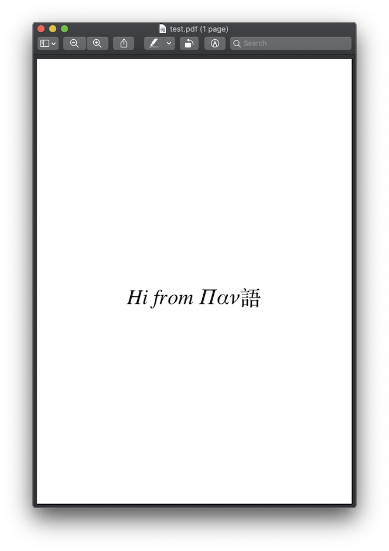

Overview
========

Installing
----------

To get started, there are multiple dependencies that require installation.

Installing cairocffi and pangocffi
__________________________________

Follow the instructions as provided by these dependencies:

* `Installing cairocffi`_
* `Installing pangocffi`_

.. _Installing cairocffi: https://cairocffi.readthedocs.io/en/stable/overview.html
.. _Installing pangocffi: https://pangocffi.readthedocs.io/en/stable/overview.html

Installing pangocairocffi
_________________________

Install with pip_::

    pip install pangocairocffi

.. _pip: https://pip.pypa.io/

Note: Python versions < 3.6 are not supported.

Importing pangocairocffi
------------------------

The module to import is named ``pangocairocffi``, however you are welcome to alias
the module as ``pangocairo``::

    import pangocairocffi as pangocairo

pangocairocffi will dynamically load PangoCairo as a shared library upon importing. If it fails to find it, you will
see an exception like this::

    OSError: dlopen() failed to load pangocairo: pangocairo-1.0 / pangocairo-1.0.0

If PangoCairo is not installed as a shared library, pangocairocffi
supports specifying a path via an environment variable: ``PANGOCAIRO_LOCATION``.
Note that the loading of dynamic libraries also applies to pangocffi, so be
sure to check `Importing pangocffi`_ as well for information on how to specify
paths to Pango, GLib, and GObject.

.. _Importing pangocffi: https://pangocffi.readthedocs.io/en/latest/overview.html#importing-pangocffi

Basic usage and example
-----------------------

Below is a rough example of how to use pangocairocffi together with
pangocffi and cairocffi::

   import cairocffi
   import pangocffi
   import pangocairocffi

   # Create the surface and get the context
   filename = 'test.pdf'
   pt_per_mm = 72 / 25.4
   width, height = 210 * pt_per_mm, 297 * pt_per_mm  # A4 portrait
   surface = cairocffi.PDFSurface(filename, width, height)
   context = cairocffi.Context(surface)

   context.translate(0, height / 2)

   # Build the layout
   layout = pangocairocffi.create_layout(context)
   layout.width = pangocffi.units_from_double(width)
   layout.alignment = pangocffi.Alignment.CENTER
   layout.apply_markup('Hi from Παν語')

   # Render the layout
   pangocairocffi.show_layout(context, layout)

   # Output the surface
   surface.finish()

Which produces the following output:

